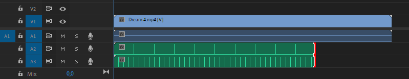

# BeatToWAV
**BeatToWAV** is a simple C++ application that records rhythmic beats (via user clicks) in real time and generates corresponding WAV files with click sounds placed at each beat. These WAV files can be used in video editing software to sync video to music or simply to visualize rhythmic patterns. It was made with AMVs and movie edits in mind.

How the generated .wav looks like in Premiere Pro:

## Features

- Calculates the time intervals between clicks to determine beat duration.
- Creates a base WAV file and can also generate additional files with subdivided (sub-) beats.

## Requirements

- Windows (uses `<conio.h>` for key detection).

## Usage

Download the newest release from the releases tab. Double click to open or run via cmd or powershell.

When you run BeatToWAV, you'll see a welcome message explaining the process.

After recording, if you input:

    Base beats: 189
    Additional sub-beats per beat: 2

The program will generate:

    A base WAV file (output_1.wav) with 189 beats in length.
    An additional WAV file (output_2.wav) will be created with each beat subdivided into two sub-beats.

Note: WAV files will be created in the same location as BeatToWAV.exe.

## Acknowledgments

Special thanks to my buddy ChatGPT o3 mini for knowing how to write a .wav file.

## License

This project is licensed under the MIT License. See the LICENSE file for details.
